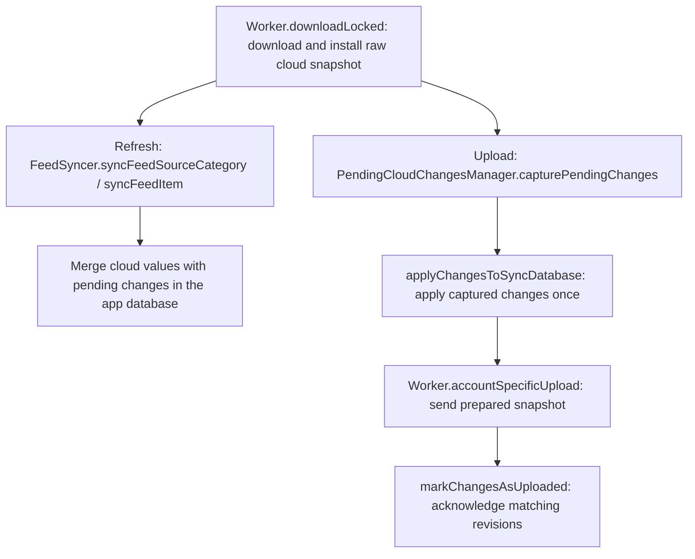

# Cloud sync regression harness

This harness covers successful Dropbox, Google Drive and iCloud workflows and
regressions added with the cloud sync fixes. Server accounts (GReader, Feedbin and
others) are outside this harness.

## Structure

`shared/src/commonTest/.../test/cloudsync` holds the scenarios, fixture device API
and deterministic cloud byte store. Each device has its own Koin application,
settings, main database and sync database. Actions go through the real repositories
and platform worker. RSS content is seeded locally between source and item sync.
Provider doubles read and write the actual SQLite snapshot bytes; they do not
replace the database or worker with a map of article flags.

The fake store separates providers and accounts, copies bytes at its boundaries,
and gives Drive files stable identities. iCloud saves remain staged until explicit
propagation. This models successful file transfer only: it does not claim to
implement the providers' complete consistency, authorization or conflict behavior.

| Source set / target | What it runs |
| --- | --- |
| `commonTest` | Shared store self-tests and portable success scenarios |
| `jvmTest` | Desktop worker, JDBC SQLite files and persisted properties |
| `androidTest` | Generic shared Android fixtures and byte transports |
| `androidHostTest` | **Robolectric, no emulator**; Android worker, JDBC SQLite files, preferences and WorkManager queue |
| `androidDeviceTest` | Optional instrumentation lane using the Android SQLite driver |
| `iosTest` | iOS worker, native SQLite files and isolated persisted defaults on the simulator |
| `feedSync/icloud/iosTest` | Real iOS iCloud file adapter with local folder URLs |
| `feedSync/ikloud-macos/ikloudTest` | Real macOS Foundation upload/download helper with local URLs |
| `iosApp/Tests/CloudSync` | Swift provider adapter callbacks and bytes with SDK boundary doubles |

The macOS native helper tests run separately from the JVM bridge double. Neither
requires a real iCloud account. The shipping JNI library and Apple background
delivery require separate integration validation; a passing double is not proof of
those mechanisms.

## Cloud sync notifications

`FeedSyncMessageQueue.messageQueue` retains every engine result for diagnostics and
the harness. UI consumers use `userMessages`: transfer, discovery, snapshot and
reconciliation failures stay quiet, including when refresh or Backup triggers the
attempt. Pending changes remain available for the next sync opportunity, and the
last successful sync timestamps do not advance on failure.

Google Drive reauthorization prompts are emitted once per active UI collector until
a successful sync result resets suppression. Explicit iCloud connection attempts
still report an unavailable service; background iCloud URL failures remain silent.
Provider authentication feedback remains available. Upgrades use ordinary sync
without a special recovery flow or user decision. `FeedSyncMessageQueueTest` tests this policy, and
`CloudTransferRegressions` asserts that real worker failures and retries emit no UI
notifications across the supported platforms/providers.

## Successful baseline

Every supported provider runs the same independent scenarios:

- Initial upload and second-device download of subscriptions, categories and flags.
- Sequential edits in both directions.
- Supported unread/unbookmark transitions while the other flag remains true.
- Repeated sync with stable state and one remote backup.
- Normal close/reopen using the existing database files and saved credentials.
- Bulk mark-as-read with bookmarks preserved.
- Adding a subscription and category after an initial sync.

`CloudFlagRegressions` checks all 16 transitions between the four read/bookmark
states, including explicit false/false values, sender refresh after upload, peer
refresh and clearing a bulk-read result. Its stale-device refresh test verifies
that refresh never uploads an old snapshot over a peer's newer bookmark and
subscription. Pending article and collection regressions below additionally cover
retaining local intent across downloads; competing remote writes remain separate work.

`CloudTransferRegressions` checks confirmed-missing bootstrap, failed upload
retaining pending work and remote bytes, failed first download performing no
upload, stopped reconciliation, and a successful retry. iCloud local file absence
is an unavailable download, not proof of remote absence: automatic first-upload
requires future metadata discovery; the existing explicit backup action remains
available. Apple's [iCloud document guide](https://developer.apple.com/documentation/uikit/synchronizing-documents-in-the-icloud-environment)
explains why local filesystem lookup cannot discover unmaterialized documents.

SDK transport tests cover Drive discovery errors, duplicate identities, stale IDs
and pagination, plus Dropbox missing-path classification. Swift callbacks carry
Drive's resolved ID through the local write before caching it. Native iCloud tests
cover replacement and preserving the last backup when an upload copy fails.

`CloudSnapshotRegressions` pauses the upload before reading its file, changes a
local article through the real repository, and verifies that the peer receives
the captured snapshot while the sender keeps the newer edit. It runs for desktop
and Android Dropbox/Drive and iOS Dropbox/iCloud. The iOS Drive adapter already
passes materialized NSData to its SDK boundary; the synchronous desktop iCloud
JNI transfer instead holds the database lifetime lock through its local copy.
They also verify that a later edit remains pending when the earlier upload
finishes, and that a second upload transfers and acknowledges it. A persisted
generation changes on every dirty mark; only the generation captured before
snapshot preparation can be cleared. Common settings tests cover repository
recreation, legacy boolean-only state and interrupted acknowledgment. This is
local upload acknowledgment. The pending-intent regressions additionally exercise
durable per-field intent and account/session guards.

The sync helper serializes complete SQL operations with closing and file work.
JVM lifetime tests use a real driver with deterministic barriers to prove that
close waits for active queries, file work prevents reopening, and close failures
stop work until retry succeeds. Platform success suites also exercise WAL-backed
files and close/reopen. Every provider validates downloaded snapshots before
installing them. Portable regressions reject empty, truncated, corrupt and
future-version files while preserving both the main data and the usable sync
database; complete legacy version-zero files remain supported.

The desktop sync database factory validates existing files read-only before
opening them for writes. Its tests preserve invalid bytes, unsupported versions,
incomplete schemas and paths involved in storage failures instead of deleting
them. Cross-process database ownership remains separate work. Legacy cloud dirty
state follows the ordinary cloud-first flow described below; general database repair remains separate.
The desktop iCloud JNI bridge downloads into a caller-owned staging file; rebuild
both native libraries whenever this interface changes.

Pending article intent, transaction rollback, restart, account changes and sync
after upgrade have regressions. `CloudFeedAndCategoryRegressions` exercises offline
source renames across restart, unrelated remote subscription/bookmark changes, and
deletion of the final source/category on every supported provider/platform. For
Dropbox and Drive it also checks direct stale-device backup against a fresh remote
base, and verifies that a failed fresh download prevents upload.

Collection database tests cover transactional rollback, field coalescing,
revision-specific acknowledgment, delete/re-add, and upgrades from pre-journal
state. Session-rotation tests also reject old-account and local-only edits after an
account change. Local edits update the durable journal; they no longer separately
copy caller snapshots into the working sync database. Applying captured changes checks the
session while holding the sync database lifetime gate. Core merge tests check
unrelated-field preservation, explicit null values,
delete-versus-rename behavior, empty collections, and category-name collisions.
An edit cannot recreate a remotely deleted entity; an explicit create can restore
it. Colliding category titles stop reconciliation and retain pending work.

Fresh-base upload currently applies to Dropbox and Drive. iCloud still needs an
authoritative discovery/bootstrap design before applying the same orchestration.
A successful fresh download does not protect the later upload from a racing writer:
remote conditional writes, ambiguous acknowledgments, and iCloud conflicts remain
separate work. These tests do not prove the absence of all unseen corner cases.

## Local and CI execution

Run the ordinary Gradle gate from the repository root:

```sh
./gradlew --quiet --console=plain allTests
```

`allTests` keeps the normal source-set tests and includes the cloud-sync suites.
The suites exchange real SQLite snapshot bytes between producer and consumer
devices for desktop and Android hosts, and include the iOS shared, macOS native
helper and Swift adapter tests on macOS arm64. Android cloud-sync tests use
Robolectric and do not start an emulator or require a device. iCloud is skipped
on non-Mac JVM hosts; Drive is unavailable in the shipping Flatpak build.

The optional Android instrumentation source set remains outside the normal gate.
Run it only when a device or emulator is deliberately available:

```sh
./gradlew --quiet --console=plain :shared:connectedAndroidDeviceTest
```

On macOS arm64, the Swift task requires Xcode with an iPhone 17 Pro simulator
and XcodeGen (`brew install xcodegen`). It generates the Xcode project and builds
its Kotlin framework through Gradle dependencies; Xcode does not invoke Gradle
recursively. CI prepares dummy iOS configuration files. For a fresh local checkout,
follow the repository's initial setup instructions.

The Gradle test reports remain in the normal `build/test-results` and
`build/reports/tests` directories. Snapshot files exchanged by producer and
consumer tests are written under `shared/build/cloud-sync-artifacts` and can be
uploaded as CI artifacts when a job fails. CI uses normal Gradle output without
`--quiet` or `--console=plain`. The Swift test result bundle is written under
`shared/build/reports/tests/swiftCloudSyncTest` on macOS.

The harness uses deterministic provider doubles and does not exercise live
provider accounts or SDK credentials; Gradle/Xcode may still download build
dependencies. A passing double is not proof of shipping JNI loading or Apple's
background iCloud delivery.

Stage B preserves PR #1358's contributor attribution through cherry-pick
`a38006731`, followed by the separate corrective commit `9fbe29e50`. The unsafe
upload-before-download ordering is removed; regression coverage builds on the
Stage A success suite.

## Verification and remaining evidence

The macOS arm64 gate exercises the Android/Robolectric, iOS, desktop, native
helper, Swift adapter and directed provider/platform snapshot exchange suites.
Windows and Linux `allTests` jobs are configured in the main code-check workflow,
but their execution is not yet proven locally. Live iCloud/JNI behavior, Apple's
background propagation, and optional Android instrumentation remain separate
validation work.

When adding a scenario, add its enum case and assertions to
`CloudSuccessScenarios.kt`. Platform bindings should supply storage and transport
details only. Run `allTests` on the affected hosts when a portable scenario
changes, and inspect the normal Gradle reports together with
`shared/build/cloud-sync-artifacts`.

Regenerate the Android baseline profiles before a performance-sensitive release:
some provider constructors gained optional test dependencies, so their recorded
constructor signatures have changed. Do not hand-edit the generated profiles.

Upgrades use the same cloud-first sync flow as ordinary refresh and backup.
There is no separate legacy-recovery checkpoint, SQL dump, local recovery archive,
or recovery UI. The accepted trade-off is that untracked pre-upgrade changes may
lose to cloud values; this is best-effort compatibility, not a legacy migration
guarantee.

Pending edits are named by their domain:

- `CloudPendingArticleFlag` / `cloud_pending_article_flag`: article read and bookmark flags.
- `CloudPendingFeedOrCategoryChange` / `cloud_pending_feed_or_category_change`: feed and
  category creation, deletion, renaming and field changes.
- `CloudFeedAndCategorySnapshot`: the feeds/categories being merged, rather than pending edits.

The upload batch exposes `articleFlags` and `feedAndCategoryChanges`; both follow
the same capture, apply and revision-checked acknowledgment workflow.

`PendingCloudChangesManager` owns this lifecycle. Workers call it directly;
`FeedSyncer` handles importing snapshots into the app database and the sync
database's file lifetime.

Refresh and upload have distinct destinations for pending changes:



Installing a download does not modify that snapshot with pending changes. During
refresh, `mergeFeedAndCategoryChangesIntoAppDatabase` and
`DatabaseHelper.updateFeedItemReadAndBookmarked` preserve pending local changes
while importing into the app database. During upload, the worker captures pending
changes after download/bootstrap, applies that batch to the sync database once,
then exports and uploads it. Each Dropbox retry starts from a fresh download and
captures another batch. An edit made after capture remains pending until a later
successful upload includes its revision.

Code entry points: `shared/src/commonMain/kotlin/com/prof18/feedflow/shared/domain/feedsync/`
contains `PendingCloudChangesManager.kt` and `FeedSyncer.kt`; platform workers
are under the corresponding `androidMain`, `iosMain`, and `jvmMain` source sets.
The pending tables and atomic app-database mutations live in `database/src/commonMain/`.

Read/bookmark and feed/category intent live in the main database per account session.
Visible edits and pending revisions commit together; upload acknowledgments retire
only captured revisions. Pending rows survive article cache eviction. Backup
scheduling and UI observe the table, covering a crash before the Settings write.

Portable upgrade regressions cover refresh and backup as the first action, quiet
failure/retry across restart, cloud-first convergence, and precisely tracked new
edits. A backup installs the latest sync snapshot and replays pending edits before
upload; a subsequent refresh reconciles the visible main database through the
ordinary source/category and item paths.

A provider-confirmed missing backup bootstraps the full local data. Unknown,
unavailable or invalid cloud state never permits that bootstrap. Pending edits
and the upload-required setting remain until a successful upload.

Whole-snapshot multi-writer safety on Drive/iCloud and mixed-version guarantees
remain explicitly deferred in the main sync plan.
