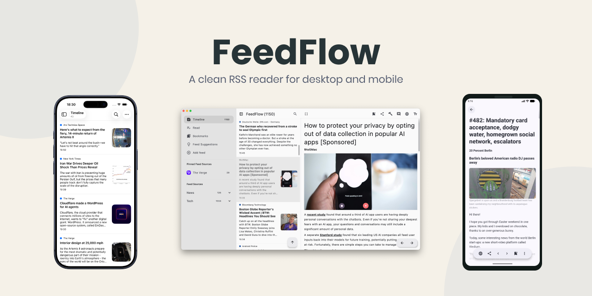

<div align="center">
  
  <h1>FeedFlow</h1>
</div>

FeedFlow is a minimalistic RSS Reader that I've built for myself and that's now available on Android, iOS, and macOS.

The majority of websites with an RSS feed don't share the article's content because they want you to go on their website. For this reason, FeedFlow always opens the original website, but you can choose the browser that you want (on mobile). For example, you can open an article on DuckDuckGo or Firefox Focus with all the trackers disabled and then just kill all the navigation data. In this way, the reading experience is separated from your main browser instance.

Your existing RSS collection can be easily imported: FeedFlow offers full and easy import and export capabilities through OPML files.

Feel free to open an issue (or, even better, a PR :)) if something is not working or if you want to propose a new feature.

<div align="center">
  
</div>

## Tech Stack

FeedFlow is built with Jetpack Compose, Compose Multiplatform, and SwiftUI. All the logic is shared using Kotlin Multiplatform.

FeedFlow uses [RSSParser](https://github.com/prof18/RSS-Parser), an RSS parsing library I've built for Android, which is now Multiplatform!

## Download 📦

FeedFlow is available for Android, iOS, and macOS.

<div align="center"><a href="https://apps.apple.com/us/app/feedflow-rss-reader/id6447210518"></a></div>
<div align="center"><a href="https://play.google.com/store/apps/details?id=com.prof18.feedflow"></a></div>
<div align="center"><a href="https://apps.apple.com/it/app/feedflow-rss-reader/id6447210518"></a></div>
<div align="center"><a href="https://f-droid.org/packages/com.prof18.feedflow">
    
</a>
</div>

You can also download the latest macOS version from [GitHub Releases](https://github.com/prof18/feed-flow/releases/latest),
or use [Homebrew](https://formulae.brew.sh/cask/feedflow).

```bash
brew install --cask feedflow
```

## Translating 🌍

If you want to help translate FeedFlow, I will be more than happy.

To add a new translation, you can use [Weblate](https://hosted.weblate.org/engage/feedflow/) or open a pull request with a new `strings.xml` file inside the `i18n/src/commonMain/resources/locale/values-<language-code>/strings.xml` folder and new files inside the `assets/storecopy/<language-code>` folder (where `<language-code>` is a [two-letter ISO 639-1 language code](https://en.wikipedia.org/wiki/ISO_639-1)). 

<div align="center">
<a href="https://hosted.weblate.org/engage/feedflow/">

</a>
</div>

## License 📄

```
   Copyright 2023 Marco Gomiero

   Licensed under the Apache License, Version 2.0 (the "License");
   you may not use this file except in compliance with the License.
   You may obtain a copy of the License at

       http://www.apache.org/licenses/LICENSE-2.0

   Unless required by applicable law or agreed to in writing, software
   distributed under the License is distributed on an "AS IS" BASIS,
   WITHOUT WARRANTIES OR CONDITIONS OF ANY KIND, either express or implied.
   See the License for the specific language governing permissions and
   limitations under the License.
```
