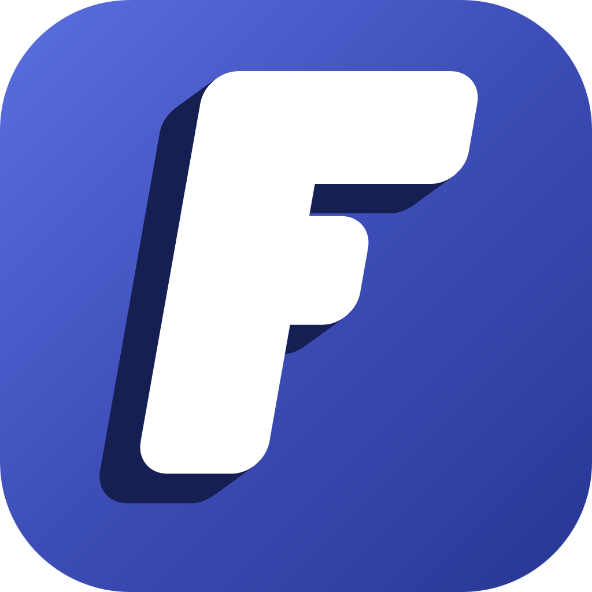
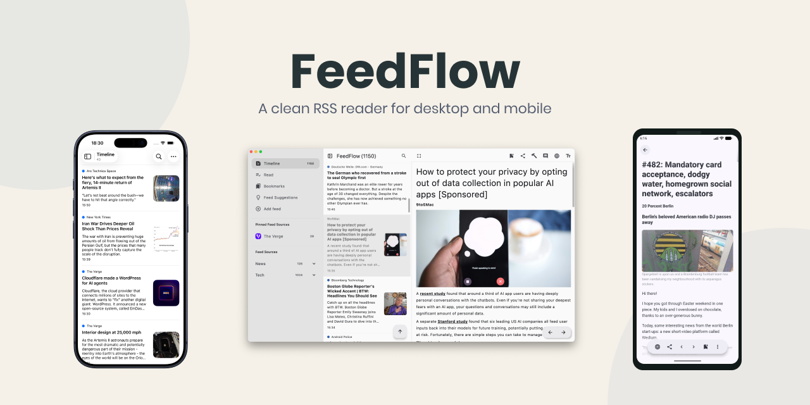

<div align="center">
  
  <h1>FeedFlow</h1>
  <p><strong>Minimal, fast RSS reading without the clutter.</strong></p>
  <p>
    FeedFlow is an RSS reader project with apps for Android, iOS, macOS, Windows, and Linux.
    It uses Kotlin Multiplatform for shared logic, Compose Multiplatform for Android and Desktop,
    and SwiftUI for iOS-specific UI.
  </p>
  <p>
    It focuses on a clean timeline, flexible reading modes, and control over sync and storage.
  </p>
  <p>
    <a href="https://www.feedflow.dev">Website</a>
    ·
    <a href="https://github.com/prof18/feed-flow/releases/latest">Latest release</a>
    ·
    <a href="https://github.com/prof18/feed-flow/issues">Issues</a>
    ·
    <a href="https://hosted.weblate.org/engage/feedflow/">Translate</a>
  </p>
  <p>
    
    
    
  </p>
</div>



## Why FeedFlow

- Read articles the way you want: Reader Mode, the in-app browser, or your preferred browser
- Keep your library local, sync it through cloud storage, or connect directly to reader services
- Organize a busy timeline with bookmarks, filters, and blocked words
- Move data in and out easily with OPML feed import/export and CSV article import/export

## Highlights

- Dedicated apps for Android, iOS, macOS, Windows, and Linux
- Flexible reading modes: Reader Mode, the in-app browser, or your preferred browser
- Flexible sync and storage options: local library, Dropbox, Google Drive, iCloud, FreshRSS, Miniflux, Feedbin, and BazQux Reader
- Offline reading by saving article content during sync
- Timeline, read status, bookmark, source, and category filters
- Blocked words to hide articles containing specific keywords or phrases
- Curated feed suggestions across different topics
- Theme modes for system, light, dark, and OLED
- Widgets for Android and iOS

## Download

| Platform | Get FeedFlow |
| --- | --- |
| Android | [Google Play](https://play.google.com/store/apps/details?id=com.prof18.feedflow) or [F-Droid](https://f-droid.org/packages/com.prof18.feedflow) |
| iPhone and iPad | [App Store](https://apps.apple.com/us/app/feedflow-rss-reader/id6447210518) |
| macOS | [Mac App Store](https://apps.apple.com/us/app/feedflow-rss-reader/id6447210518), [Homebrew](https://formulae.brew.sh/cask/feedflow), or [GitHub Releases](https://github.com/prof18/feed-flow/releases/latest) |
| Windows | [Microsoft Store](https://apps.microsoft.com/detail/9N5T1RFBB6V5?mode=direct) or [GitHub Releases](https://github.com/prof18/feed-flow/releases/latest) |
| Linux | [Flathub](https://flathub.org/en/apps/com.prof18.feedflow) or [GitHub Releases](https://github.com/prof18/feed-flow/releases/latest) |

## What You Can Do With FeedFlow

### Read Your Way

FeedFlow does not lock you into a single article view. Open links in Reader Mode, use the in-app browser,
or send them to your preferred browser. Reader Mode also includes extras like opening comments directly
and sharing articles without leaving your reading flow.

### Keep Control Over Sync and Storage

You can keep everything local, use storage backends like Dropbox, Google Drive, or iCloud,
or connect directly to reader services such as FreshRSS, Miniflux, Feedbin, and BazQux Reader.

### Stay on Top of a Busy Timeline

Use bookmarks, read and unread states, timeline filters, source and category views, and blocked words.
FeedFlow also supports auto-saving article content for offline reading and includes cache cleanup tools.

### Discover New Feeds Faster

Feed suggestions are built into the app, with curated sources across ten categories, so a fresh install
does not have to start from zero.

## Building From Source

### Prepare Local Config

Android:

```bash
cp config/dummy-google-services.json androidApp/src/debug/google-services.json
cp config/dummy-google-services.json androidApp/src/release/google-services.json
```

iOS:

```bash
cp config/dummy-google-service.plist iosApp/GoogleService-Info-dev.plist
cp config/dummy-google-service.plist iosApp/GoogleService-Info.plist
cp config/dummy-config.xcconfig iosApp/Assets/Config.xcconfig
brew install xcodegen
cd iosApp && ./.scripts/generate-project.sh
```

If you want to test real iOS sync providers locally, start from `iosApp/Assets/Config.xcconfig.template`
instead of the dummy config and fill in your own keys.

The iOS Xcode project is generated from `iosApp/project.yml` and is not committed, except for
`iosApp/FeedFlow.xcodeproj/project.xcworkspace/xcshareddata/swiftpm/Package.resolved`.
The generation script also creates the ignored `iosApp/Assets/Config-Debug.xcconfig` from its
tracked template when it is missing.

Regenerate the project whenever `iosApp/project.yml`, iOS source structure, xcconfig files,
entitlements, or SwiftPM dependencies change. If SwiftPM dependencies change, resolve packages
and commit the updated `Package.resolved` lockfile too.

Optional local keys:

- `keystore.properties` for Android/Desktop Dropbox keys
- `desktopApp/src/jvmMain/resources/props.properties` for Desktop Dropbox keys
- `iosApp/Assets/Config.xcconfig` for iOS Google Drive and Dropbox config
- `iosApp/Assets/Config-Debug.xcconfig` for iOS debug Google Drive overrides

## Tech Stack

- Kotlin Multiplatform for shared business logic
- Compose Multiplatform for Android and Desktop UI
- SwiftUI for iOS-specific UI
- SQLDelight-backed local storage
- [RSSParser](https://github.com/prof18/RSS-Parser) for feed parsing

## Translating

If you want to help translate FeedFlow, use [Weblate](https://hosted.weblate.org/engage/feedflow/)
or open a pull request with:

- a new `strings.xml` file under `i18n/src/commonMain/resources/locale/values-<language-code>/`
- matching store copy under `assets/storecopy/<language-code>/`

<div align="center">
  <a href="https://hosted.weblate.org/engage/feedflow/">
    
  </a>
</div>

## Contributing

Issues and pull requests are welcome. If you are proposing a larger feature or a platform-specific change,
opening an issue first is usually the fastest way to align on scope.

## License

FeedFlow is released under the [Apache 2.0 License](LICENSE).
