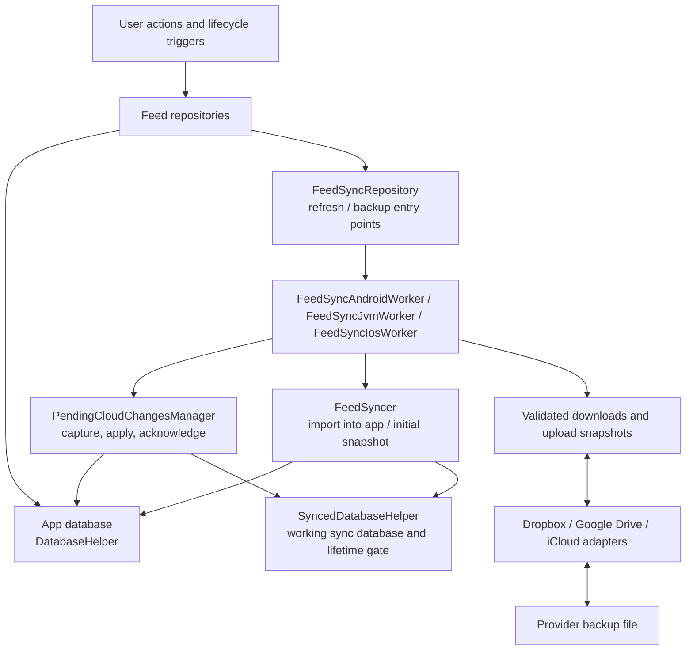
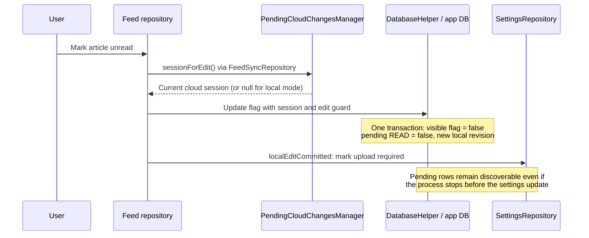
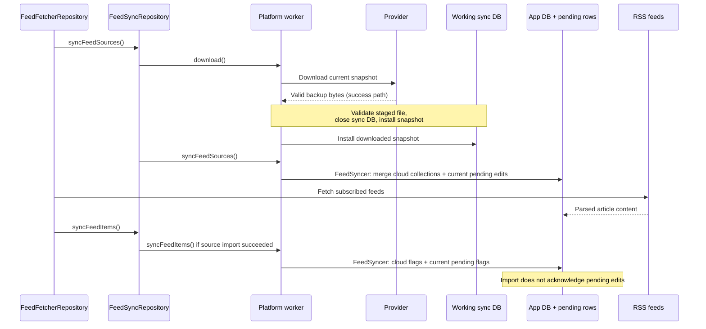
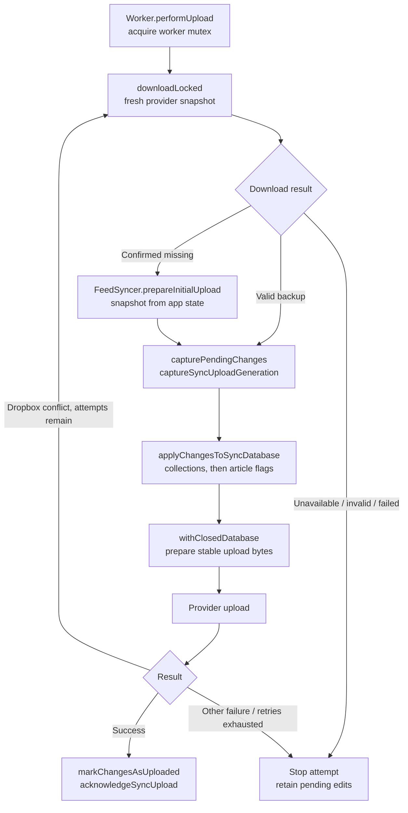
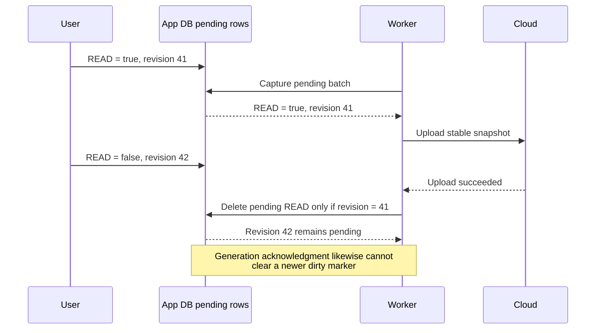
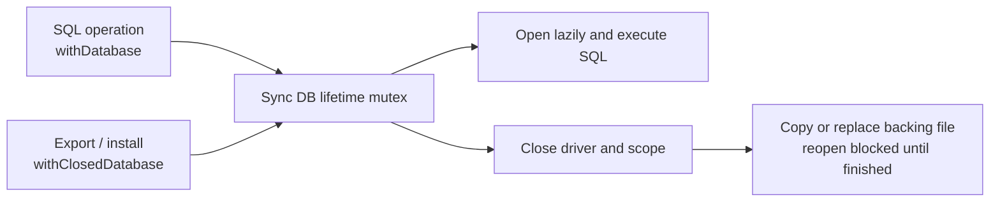
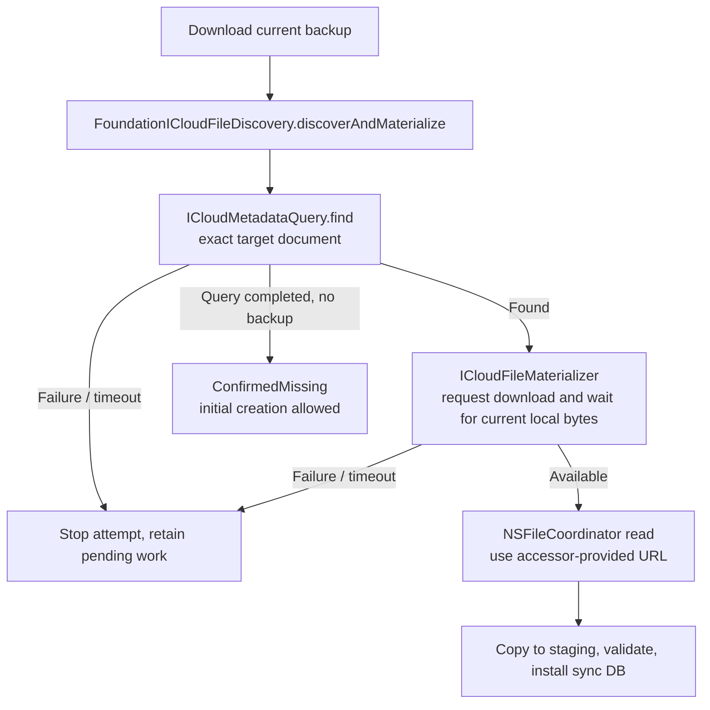
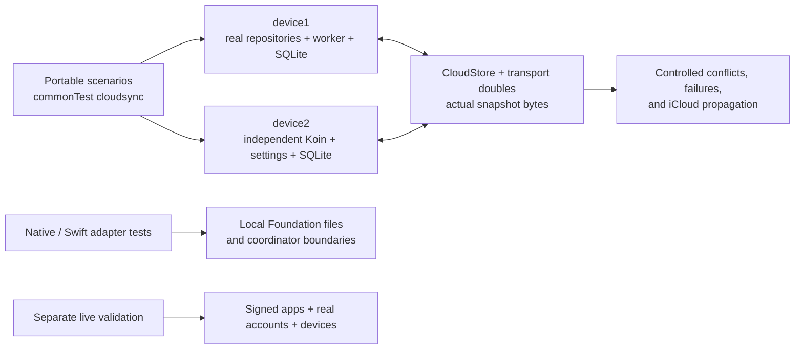

# Cloud sync architecture

FeedFlow synchronizes subscriptions, categories, and article read/bookmark flags by exchanging a **SQLite snapshot** through Dropbox, Google Drive, or iCloud. RSS feeds still supply article content. Each device keeps its own app database and records local changes so downloading a newer cloud snapshot does not discard those changes.

This document describes the current implementation, rather than a future plan. It covers cloud providers only; FreshRSS, Miniflux, BazQux, and Feedbin use separate server-sync paths. Read the [regression harness guide](CLOUD_SYNC_TESTING.md) for automated checks and the [live testing runbook](CLOUD_SYNC_LIVE_TESTING.md) for real accounts and devices.

## Contents

- [Components and ownership](#components-and-ownership)
- [What is stored and transferred](#what-is-stored-and-transferred)
- [Recording a local edit](#recording-a-local-edit)
- [Refresh: cloud into the app](#refresh-cloud-into-the-app)
- [Upload: local intent onto a fresh cloud snapshot](#upload-local-intent-onto-a-fresh-cloud-snapshot)
- [Merge rules](#merge-rules)
- [Session, revision, and generation](#session-revision-and-generation)
- [Database and file lifetime](#database-and-file-lifetime)
- [Provider behavior](#provider-behavior)
- [Failures, retries, and UI](#failures-retries-and-ui)
- [Compatibility and limits](#compatibility-and-limits)
- [Testing architecture](#testing-architecture)
- [Reading and extending the code](#reading-and-extending-the-code)

## Components and ownership



The diagram shows responsibility boundaries; the workers themselves orchestrate the file and provider operations.

| Component | Responsibility | Implementation |
| --- | --- | --- |
| Feed repositories | Commit user edits with their pending cloud changes; request backups where appropriate | [FeedSourcesRepository](../shared/src/commonMain/kotlin/com/prof18/feedflow/shared/domain/feed/FeedSourcesRepository.kt), [feed domain directory](../shared/src/commonMain/kotlin/com/prof18/feedflow/shared/domain/feed) |
| Refresh orchestration | Import subscriptions, fetch RSS, then apply article flags | [FeedFetcherRepository](../shared/src/commonMain/kotlin/com/prof18/feedflow/shared/domain/feed/FeedFetcherRepository.kt), `fetchFeedsWithRssParser` |
| Cloud entry points | Gate backups, handle first sync, prevent item import after failed source import | [FeedSyncRepository](../shared/src/commonMain/kotlin/com/prof18/feedflow/shared/domain/feedsync/FeedSyncRepository.kt) |
| Platform workers | Serialize transfer operations, obtain a fresh base, prepare files, call providers, acknowledge success | [Android](../shared/src/androidMain/kotlin/com/prof18/feedflow/shared/domain/feedsync/FeedSyncAndroidWorker.kt), [JVM](../shared/src/jvmMain/kotlin/com/prof18/feedflow/shared/domain/feedsync/FeedSyncJvmWorker.kt), [iOS](../shared/src/iosMain/kotlin/com/prof18/feedflow/shared/domain/feedsync/FeedSyncIosWorker.kt) |
| Pending-change lifecycle | Select the active session, observe work, capture edits, apply them to the sync database, acknowledge uploaded revisions | [PendingCloudChangesManager](../shared/src/commonMain/kotlin/com/prof18/feedflow/shared/domain/feedsync/PendingCloudChangesManager.kt) |
| Snapshot import and bootstrap | Import remote values into the app; construct an initial snapshot when the provider confirms absence | [FeedSyncer](../shared/src/commonMain/kotlin/com/prof18/feedflow/shared/domain/feedsync/FeedSyncer.kt) |
| App storage | Store feeds/content/flags and pending edits; perform transactional merges | [DatabaseHelper](../database/src/commonMain/kotlin/com/prof18/feedflow/database/DatabaseHelper.kt) |
| Sync storage | Read/write the smaller transferable schema and own its driver/scope lifetime | [SyncedDatabaseHelper](../feedSync/database/src/commonMain/kotlin/com/prof18/feedflow/feedsync/database/data/SyncedDatabaseHelper.kt) |
| Notifications | Separate internal sync results from user-facing authentication feedback | [FeedSyncMessageQueue](../core/src/commonMain/kotlin/com/prof18/feedflow/core/utils/FeedSyncMessageQueue.kt) |

The platform implementations are wired through Koin. Tests instantiate isolated Koin applications so multiple simulated devices can run the real repositories and workers without sharing databases or preferences.

## What is stored and transferred

| State | Contents | Sent to the provider? |
| --- | --- | --- |
| App database (`database` module) | Subscriptions, categories, fetched articles, flags, caches, and pending-change tables | No: the full app database is not uploaded |
| Working sync database (`feedSync/database` module) | The downloaded cloud snapshot, or the snapshot being prepared for upload | Yes, through a stable file/byte representation |
| Settings | Active-account session identifier, upload-required flag/generation, provider credentials and transfer timestamps | No |

The **pending-change tables live inside the app database**, not in a third database or another cloud file. They survive replacement of the working sync database.

The transferable schema contains:

| Table | Fields and role |
| --- | --- |
| [`synced_feed_source`](../feedSync/database/src/commonMain/sqldelight/com/prof18/feedflow/feedsync/database/db/SyncedFeedSource.sq) | Source ID (`url_hash`), URL, title, category ID, logo URL |
| [`synced_feed_source_category`](../feedSync/database/src/commonMain/sqldelight/com/prof18/feedflow/feedsync/database/db/SyncedFeedSourceCategory.sq) | Category ID and unique title |
| [`synced_feed_item`](../feedSync/database/src/commonMain/sqldelight/com/prof18/feedflow/feedsync/database/db/SyncedFeedItem.sq) | Article ID (`url_hash`), read flag, bookmark flag |
| [`sync_metadata`](../feedSync/database/src/commonMain/sqldelight/com/prof18/feedflow/feedsync/database/db/SyncedMetadata.sq) | Per-table change timestamps used by import logic |

Article bodies, images, reader caches, credentials, and local category positions are not part of this snapshot. Category positions are preserved locally for existing IDs during import. A receiving device fetches articles from the subscribed RSS feeds and applies cloud flags to matching article IDs.

Debug and production builds use different sync database names. Devices must use compatible build environments and the same provider account to exchange the same backup. The live runbook covers the additional iCloud container/signing requirements.

## Recording a local edit

An edit changes the visible app state and records exactly what must be preserved through the next cloud download.



Relevant entry points are `FeedSyncRepository.cloudSessionForEdit`, `cloudEditGuard`, and `localEditCommitted`; `DatabaseHelper` performs the mutation and journal write together. Local-only edits use a null session and do not create cloud intent.

Two tables represent different value types, with the same lifecycle:

- [`cloud_pending_article_flag`](../database/src/commonMain/sqldelight/com/prof18/feedflow/db/CloudPendingArticleFlag.sq): one row per session/article/flag. `CloudArticleFlag` distinguishes `READ` and `BOOKMARK`; the value is Boolean, including explicit `false`.
- [`cloud_pending_feed_or_category_change`](../database/src/commonMain/sqldelight/com/prof18/feedflow/db/CloudPendingFeedOrCategoryChange.sq): one row per session/entity/ID/field. Typed enums distinguish source/category and `EXISTS`, `URL`, `TITLE`, `CATEGORY`, `LOGO`; the value is nullable text.

Repeated edits to the same field replace its pending row with the latest value and a newer local revision. This is a compact record of outstanding intent, not an ever-growing event history. Creation records the fields needed to construct an entity; deletion records `EXISTS = "0"`.

`CloudFeedAndCategorySnapshot` is different: it is the full collection state being merged. `CloudUploadBatch` contains captured pending article and collection edits, their session, and account. Neither is another persistent store.

## Refresh: cloud into the app

Normal refresh starts with download. Pending work does not cause an old local snapshot to be uploaded first.



`FeedSyncer.syncFeedSourceCategory` delegates the combined category/source merge to `PendingCloudChangesManager.mergeFeedAndCategoryChangesIntoAppDatabase`. With the production manager installed, the following `syncFeedSource` call does not apply the older source-only import again.

`FeedSyncer.syncFeedItem` imports flags after RSS parsing. In cloud replacement mode, `DatabaseHelper.updateFeedItemReadAndBookmarked` resets app flags, applies snapshot values, then overlays the current session's pending flags in the same mutation. An article omitted from the cloud flag snapshot therefore starts with both flags false, unless local pending intent overrides it. The existing metadata equality check can skip an unchanged flag import.

Refresh merges into the **app database**. It does not apply pending edits to the downloaded sync file. The journal remains pending until a confirmed upload acknowledges it.

If download or collection merge fails, `canApplyDownloadedItems` remains false, so flags from that attempted refresh are not applied. RSS fetching can continue from the available local subscriptions. If there are no sources, the fetcher returns before the item phase.

Confirmed backup absence is a separate branch: the repository requests an immediate initial upload. Ordinary connection and download errors do not enter that branch.

## Upload: local intent onto a fresh cloud snapshot

`FeedSyncRepository.enqueueBackup` and `performBackup` normally require an enabled cloud account plus either pending rows or an upload-required marker. Explicit `forceBackup` bypasses the work check, not the fresh-download step. Android enqueues connected-network WorkManager work; JVM and iOS launch their worker coroutine. Immediate backup calls the upload path directly.

Backup opportunities come from UI actions, some subscription changes, and platform lifecycle/timer hooks. Recording an edit does not itself promise immediate delivery. See [Android FeedFlowApp](../androidApp/src/main/kotlin/com/prof18/feedflow/android/FeedFlowApp.kt), [desktop MainWindow](../desktopApp/src/jvmMain/kotlin/com/prof18/feedflow/desktop/main/MainWindow.kt), and [iOS FeedSyncTimer](../iosApp/Source/App/FeedSyncTimer.swift).



Every provider follows this fresh-base path, including iCloud. An existing backup supplies the base; only a confirmed-missing result permits `FeedSyncer.prepareInitialUpload` to seed it from current app subscriptions, categories, and all article flags.

For an existing backup, the upload does **not** copy the entire app state over the cloud. It applies captured field changes to the fresh snapshot once and sends the resulting whole sync database. Unrelated cloud fields survive because they came from that fresh base.

The downloaded file is not imported into the app as a side effect of upload. A later refresh imports it. This keeps the two paths explicit: refresh changes app state; upload constructs provider state.

There is a download before each upload attempt. A refresh followed by backup can therefore download twice, and a Dropbox conflict retry downloads again. There is no shared refresh-to-upload freshness cache. This is the current trade-off for protecting unrelated remote changes without a more complex cache protocol.

### Example: a stale device edits one field

1. device1 and device2 share a snapshot.
2. device1 bookmarks article X and adds a subscription, then uploads.
3. device2, still stale, marks article Y unread. Its journal records only `Y.READ = false`.
4. device2 uploads: it downloads device1's snapshot and applies that one flag.
5. The upload retains article X's bookmark and the new subscription. On refresh, device2 imports those changes too.

The journal solves both offline/stale-device merging and edits made while a transfer is running. It is not only machinery for simultaneous device use.

## Merge rules

The same collection merge implementation is used when importing into the app and when preparing an upload: [`CloudFeedAndCategorySnapshot.applyCloudFeedAndCategoryChanges`](../core/src/commonMain/kotlin/com/prof18/feedflow/core/model/CloudFeedAndCategorySnapshot.kt).

| Situation | Result |
| --- | --- |
| Cloud changed one field; device changed another | Start from cloud and overlay only the recorded local field |
| Cloud and pending local edit changed the same field | Pending local value wins for this merge; no cross-device timestamp arbitration |
| Explicit unread or unbookmark | `false` is preserved as an edit, not treated as absence |
| Remote entity deleted; device only renamed/edited it | An update does not recreate the missing entity |
| Device explicitly creates/re-adds an entity | `EXISTS = "1"` with creation fields can create it |
| Device deletes an entity | `EXISTS = "0"` removes it from the merged snapshot |
| Category removed | Sources referencing it become uncategorized in the merged result |
| Nullable category/logo explicitly cleared | A present pending field with a null value clears it; an absent field preserves cloud state |
| Final source/category deleted | Empty collections are valid and are reconciled into the app |
| Two category IDs end with the same title | Merge fails rather than violating the unique-title constraint; pending edits remain |

Categories are merged before sources so category references resolve against the final category set. Main-database reconciliation removes subscriptions no longer present and associated local article/cache rows. Category positions are preserved by ID. These operations do not create new user-intent rows for imported cloud values.

Article flags use the same field-overlay principle through `SyncedDatabaseHelper.applyPendingArticleFlags` and `DatabaseHelper.updateFeedItemReadAndBookmarked`, rather than through the collection model.

## Session, revision, and generation

These identifiers solve different bookkeeping problems. None is a global ordering of edits across devices.

| Name | Where it lives | Meaning |
| --- | --- | --- |
| Cloud session | Settings UUID; pending rows are scoped by provider name plus UUID | Which account connection owns the pending work |
| Pending-row revision | `cloud_sync_state.next_revision` and each journal row in the app DB | Whether a field still has the exact edit captured by an upload |
| Upload generation | `SettingsFields.SYNC_UPLOAD_GENERATION`, a UUID token | Whether the broader upload-required marker has changed since capture |
| Dropbox revision | Provider metadata, held by the worker after download | Which remote file version an upload is permitted to replace |
| Sync metadata timestamps | Per-table snapshot metadata | Import freshness hints; not a distributed conflict clock |

[`AccountsRepository`](../shared/src/commonMain/kotlin/com/prof18/feedflow/shared/domain/feedsync/AccountsRepository.kt) rotates the cloud session when clearing an account or clearing other credentials while selecting an account. It is not rotated for each refresh or upload. Older-session pending rows are excluded from the new session's work. Session checks guard local mutation, snapshot installation/application, and acknowledgment so an old operation cannot casually acknowledge a new connection's edits. They do not make changing accounts during a remote request a distributed transaction.

[`SettingsRepository`](../shared/src/commonMain/kotlin/com/prof18/feedflow/shared/data/SettingsRepository.kt) changes the upload generation whenever work is marked dirty. The pending journal is also observed independently: work remains discoverable if a process stops between committing the database edit and updating settings.

### An edit during upload



`markChangesAsUploaded` deletes only captured rows whose revisions still match. It does not clear the journal wholesale. If work remains, it marks upload required again; `acknowledgeSyncUpload` clears settings only for the matching captured generation. A restarted iOS Dropbox background callback has no captured batch/generation, so `onDropboxUploadSuccessAfterResume` updates the timestamp without acknowledging newer work.

## Database and file lifetime

The working sync DB must be closed before replacing or exporting its backing file. The app database stays open; it is not the file being transferred.

`SyncedDatabaseHelper.withDatabase` holds a mutex for the complete SQL operation. `withClosedDatabase` acquires the same mutex, closes the driver and Koin scope, and keeps the mutex throughout file work. The next query opens a new scope/driver lazily. If close fails, file work does not proceed; later access retries closing before reopening.



Each platform worker also has its own mutex around upload/download/import calls. A complete upload, including conflict retries, holds this worker mutex; the refresh's separate download/source/item calls are not one all-enclosing transaction.

Downloads go to staging files and are validated before replacing the working DB. [`validateSyncDatabase`](../feedSync/database/src/commonMain/kotlin/com/prof18/feedflow/feedsync/database/data/SyncDatabaseValidation.kt) checks schema version, SQLite integrity, and required table columns. Complete legacy files with `user_version = 0` are accepted and normalized; future versions, incomplete schemas, and corrupt files are rejected. The [JVM database factory](../feedSync/database/src/jvmMain/kotlin/com/prof18/feedflow/feedsync/database/DatabaseDriverFactory.kt) also validates existing files before writable opening rather than deleting unrecognized data.

For upload, Android and iOS export a temporary stable snapshot while the DB is closed; JVM does so for Dropbox and Drive. Transfer then reads those stable bytes rather than a DB that could be reopened and changed. Desktop iCloud holds the lifetime gate through its synchronous JNI file copy instead. Temporary files are cleaned up after the attempt.

These are in-process lifetime guarantees. They do not establish ownership of the app/sync databases across separate processes. Apple `NSFileCoordinator` handles access to the iCloud document; it is not a replacement for local SQLite lifetime rules. iOS wraps relevant worker operations in `withSuspensionGuard` to protect work across foreground suspension intervals, not to guarantee unlimited background execution.

## Provider behavior

| Provider | Platforms | Freshness and replacement behavior | Remaining limitation |
| --- | --- | --- | --- |
| Dropbox | Android, iOS, desktop | Download returns revision with bytes; update requires that revision, or create-only after confirmed absence | Old clients can still overwrite unconditionally; exhausted retries keep work pending |
| Google Drive | Android, iOS, desktop; unavailable in shipping Flatpak | Discover exact backup identity in `appDataFolder`, download fresh file, update/create resolved identity | No atomic conditional-write guarantee; simultaneous writers can still overwrite |
| iCloud | iOS and macOS desktop | Discover/materialize current available document, coordinate local document read/write, stage replacements | Local save success does not mean another device has received it; no distributed conflict merge |

### Dropbox

The worker retains the revision from the downloaded bytes and supplies it as `expectedRevision`. An upload after confirmed absence uses create-only behavior. [`retryDropboxConflicts`](../shared/src/commonMain/kotlin/com/prof18/feedflow/shared/domain/feedsync/DropboxConflictRetry.kt) permits at most three attempts; each conflict retry downloads afresh, captures pending work again, reapplies it, and creates a new upload snapshot.

This protects the gap between read and write when another device updates the file. A lost upload response is not treated as a confirmed success: pending work remains and a later attempt can merge it again. Provider implementations live in the [Dropbox module](../feedSync/dropbox) and [iOS Dropbox adapters](../iosApp/Source/Accounts/Dropbox/Data).

### Google Drive

Drive uses the backup filename within the app-data space and a cached file ID as an optimization. Discovery handles list failures, pagination, duplicate matches, and stale cached IDs. Those outcomes must not all be interpreted as a missing backup. A duplicate identity is an error rather than permission to choose an arbitrary file.

The fresh download protects against an ordinarily stale device, but the later write is not an atomic compare-and-swap against the version that was read. The approved scope accepts the rare overlapping-writer risk. See [Android adapter](../androidApp/src/googlePlay/kotlin/com/prof18/feedflow/feedsync/googledrive/GoogleDriveAndroidDataSourceImpl.kt), [Drive module](../feedSync/googledrive), and [iOS adapters](../iosApp/Source/Accounts/GoogleDrive/Data).

### iCloud



Finding no local file alone does not prove the cloud backup is absent. Discovery runs even if a local backup already exists, checks the exact document, and materializes its current available version. The shared implementation has a 30-second default discovery/materialization budget. Native URL status checks clear cached resource values before checking readiness. If a local backup exists but the completed metadata query does not include it, discovery returns failure rather than granting permission to create a replacement.

`NSFileCoordinator` is Apple's mechanism for coordinating access to a document with other cooperating file operations. The adapters use the URL supplied to the accessor. Upload stages the new bytes and performs a coordinated creation/replacement; failed staging or denied coordination preserves the previous document. Returning success means the local iCloud document was saved, while Apple handles delivery to other devices afterward.

The implementation is split by responsibility:

- [Shared Apple discovery](../feedSync/icloud/src/appleMain/kotlin/com/prof18/feedflow/feedsync/icloud/apple): `ICloudFileDiscovery`, `ICloudMetadataQuery`, `ICloudFileMaterializer`, `ICloudUbiquityDownload`.
- [iOS data source](../feedSync/icloud/src/iosMain/kotlin/com/prof18/feedflow/feedsync/icloud/ICloudDataSource.kt) and [coordinator](../feedSync/icloud/src/iosMain/kotlin/com/prof18/feedflow/feedsync/icloud/ICloudFileCoordinator.kt): Foundation file operations called by the iOS worker.
- [JVM native bridge](../shared/src/jvmMain/kotlin/com/prof18/feedflow/shared/domain/feedsync/ICloudNativeBridge.kt): desktop boundary to Kotlin/Native.
- [macOS helper](../feedSync/ikloud-macos/src/macosMain/kotlin/com/prof18/ikloud/ICloudHelper.kt): native discovery and coordinated file operations; downloads target a caller-owned staging path.

A completed metadata query describes the iCloud view available to that device. It is not an atomic read of a globally synchronized server followed by a protected write. Native bridge changes require rebuilding/repackaging native libraries; live macOS validation also requires correct signing, entitlements, and provisioning. The [live runbook](CLOUD_SYNC_LIVE_TESTING.md) documents those steps.

## Failures, retries, and UI

| Event | Engine behavior | User-facing behavior |
| --- | --- | --- |
| Confirmed missing backup | Build initial snapshot and attempt creation | No error snackbar for normal bootstrap |
| Download unavailable, authentication/transport failure, corrupt or future snapshot | Stop this cloud attempt before installing invalid data or uploading over it; retain pending work | Recoverable cloud failures remain quiet; authentication can require action |
| Collection merge fails, including duplicate category titles | Roll back failed app merge / stop upload preparation; keep pending intent | No reconciliation dialog; repeated attempts may continue failing until data changes |
| Upload fails or outcome is unknown | Do not acknowledge pending batch; later backup can try again | Quiet engine failure |
| Dropbox revision conflict | Fresh download and replay, up to three upload attempts | Internal retry, no conflict-choice UI |
| iCloud discovery/materialization timeout | Do not bootstrap over an unavailable backup | Quiet; wait for another sync opportunity |
| Local edit arrives during upload | Acknowledge matching captured revisions only; retain newer work | New local edit remains visible |
| Cancellation | Rethrow cancellation and clean up temporary files | No success acknowledgment from cancellation |

The queue's `messageQueue` is an in-memory result stream for active diagnostics/tests, not a durable error archive. UI consumers use `userMessages`, which filters general transfer and missing-backup results. Google Drive reauthorization feedback is suppressed after the first prompt per active collector until success resets suppression. Explicit iOS iCloud setup can report service unavailability. Provider login screens can still give authentication feedback.

Transfer timestamps are updated at successful provider/download-install stages. They are evidence of that stage, not proof that another device has imported the data. There is no dedicated global retry scheduler in the merge layer: apart from bounded Dropbox conflict retries, future attempts depend on existing backup/refresh opportunities and platform scheduling.

## Compatibility and limits

The system is deliberately best effort for one user who usually has one active device. It has no separate legacy-recovery archive, SQL dump, migration handshake, or user reconciliation screen. Here, **reconciliation means the internal merge of cloud state and tracked local edits**.

Cloud values take precedence over ambiguous, untracked pre-upgrade local changes. Precisely journaled edits use the normal overlay flow. Older clients can still upload stale snapshots without the new protections, so updating all devices is advisable; there is no forced version negotiation.

The current design does not guarantee:

- Atomic competing writes on Drive or distributed iCloud conflict resolution.
- Immediate propagation or peer acknowledgment, especially after an iCloud local save.
- Cross-process ownership/repair of the app or working sync database.
- A globally ordered edit history or timestamp-based conflict selection.
- Preservation of content no longer available from the RSS source, because article content is not in the cloud snapshot.
- Exhaustive coverage of every provider or operating-system corner case.

These limits are distinct from the protections already present: durable local intent, fresh-base upload, conditional Dropbox writes, snapshot validation, stable upload bytes, and matching-revision acknowledgment.

## Testing architecture



The harness replaces provider boundaries while keeping the real app and sync databases, repositories, and platform workers. Each simulated device has independent storage and settings. A byte store transfers real SQLite snapshots; deterministic failure injection makes interleavings reproducible.

| Layer | What it establishes |
| --- | --- |
| Database/core tests | Transactional intent, enum mappings, merge rules, revision-specific acknowledgment |
| Shared portable scenarios | Successful bootstrap, repeated sync, both directions, flags, collection edits/deletions, stale-device preservation, upgrades |
| Worker regressions | Download/upload failures, stable snapshots, edits during upload, invalid snapshots, Dropbox conflicts and retry limits |
| Platform bindings | JVM desktop, Android Robolectric without emulator, iOS simulator; optional Android instrumentation |
| Adapter/native tests | SDK request/callback mapping, Foundation file operations, discovery, coordination failure and replacement behavior |
| Cross-platform snapshot exchange | Producer/consumer compatibility using actual generated database files |
| Live runbook | Credentials, shipping adapters/JNI, signed iCloud containers, real provider delivery and visible peer state |

The ordinary gate is:

```sh
./gradlew --quiet --console=plain detekt allTests
```

`allTests` includes cloud suites on supported hosts. Android's normal lane uses Robolectric. On macOS arm64, the gate also includes Apple/native and Swift adapter tests with their Xcode/simulator prerequisites. iCloud is unavailable on non-Mac JVM hosts. CI keeps normal Gradle output and uploads diagnostic artifacts on failure.

Live checks use the [runbook](CLOUD_SYNC_LIVE_TESTING.md) and [`validate-cloud-sync` skill](../.ai/skills/validate-cloud-sync/SKILL.md), with optional [iPhone controller tooling](../tools/cloud-sync-live). They check sender state after upload **before sender refresh**, then receiver delivery, so a refresh cannot conceal a bad upload. The controller reports UI command outcomes; a successful tap or XCTest session is not itself a sync assertion.

See [CLOUD_SYNC_TESTING.md](CLOUD_SYNC_TESTING.md) for exact source sets, scenario classes, execution prerequisites, and the boundary between deterministic evidence and real-provider evidence.

## Reading and extending the code

For a code review, follow this order:

1. `FeedSyncRepository` and `FeedFetcherRepository`: when operations run and how refresh is sequenced.
2. Pending SQL tables and `DatabaseHelper`: what constitutes durable intent and how app merges work.
3. `PendingCloudChangesManager` and `CloudFeedAndCategorySnapshot`: capture, field overlay, acknowledgment.
4. The relevant platform worker: fresh download, validation/install, snapshot export, provider call.
5. `SyncedDatabaseHelper`: lifetime serialization and sync-schema operations.
6. The provider adapter, then its harness regressions and live evidence.

When adding a provider, extend its supported platform adapters and the existing harness first. Preserve the distinction between confirmed absence and failure; define whether conditional writes are supported; retain staging, stable snapshots, and acknowledgment semantics. Register the provider explicitly in each supported platform's scenario suites, then run the same live scenarios. The [new-provider checklist](CLOUD_SYNC_LIVE_TESTING.md) contains the concrete test binding paths and validation workflow.
